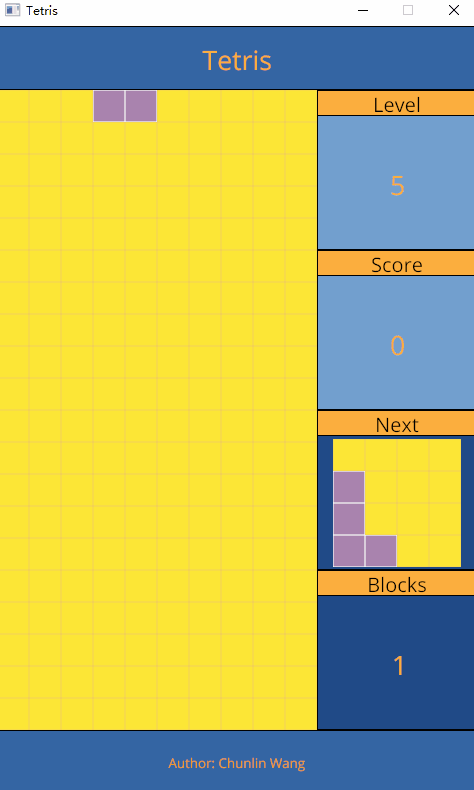

# A Mini 2D Rust Tetris Game

## A Rust Tetris.

* [Download the game for windows](https://github.com/chunlinwang/rust-tetris/blob/master/bin/tetris.exe)
* [Download the game for mac](https://github.com/chunlinwang/rust-tetris/blob/master/bin/tetris)

## Demo

## Features

* Typical Tetris
* Retry, Pause, Level System
* Score with a bonus for multiple lines
* Rust program  
* 2D, GUI library (CONROD)

## Manuals

* Button UP => Turn
* Button DOWN => Drop down
* Button Left => Move to the left
* Button Right => Move to the right
* Button R => Retry
* Button Pause/Break => Pause
* Button P => Level up (Speed up)
* Button M => Level down (Speed down)
* Button Esc => Exit

## Environment Dev:

* Rust >= 1.45.2 
* conrod_core = 0.71.0

## Application learning materials:

* [The Rust Programming Language](https://doc.rust-lang.org/book/)
* [Rust 2D, GUI library (CONROD)](https://docs.rs/conrod_core/0.71.0/conrod_core/)

## Future (TODO LIST)

* Helper in menu
* Game record register
* Sound and BGM 

## Author
* [@Chunlin Wang](https://www.linkedin.com/in/chunlin-wang-b606b159/)
